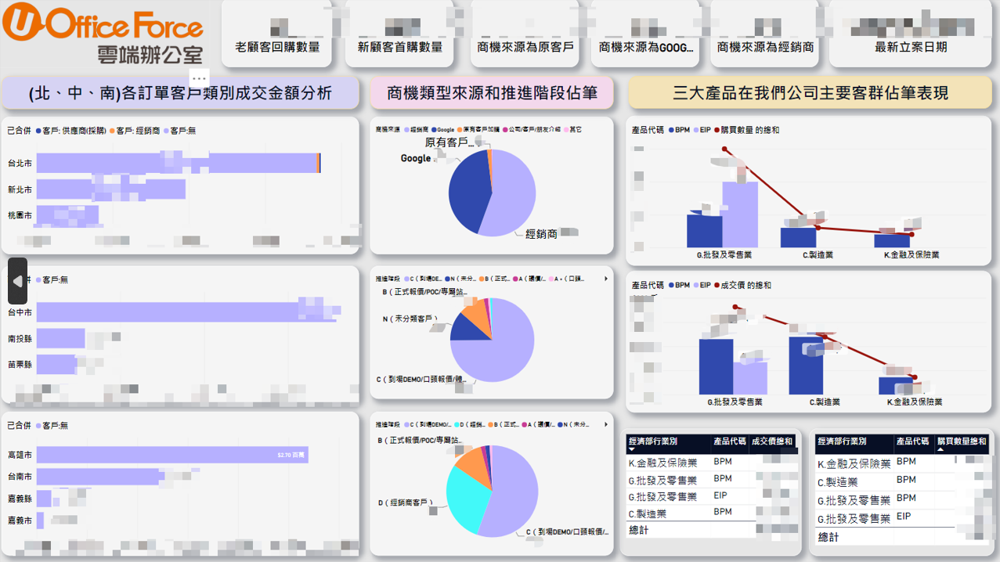

# 企業實習各項重要商業分析實作成果
所有儀錶板都使用PowerBI製作
##### (因有資安風險須打碼，還請見諒)

##### ● 各年度主要產品在各縣市銷售分析

創建了這個數據儀表板，以便更好地了解不同年度間各主要產品在不同縣市的銷售趨勢。通過分析這個數據，有助於我們進行市場區隔，針對不同地區的客戶提供更適切的產品和銷售策略。

##### ● 三大主要產品個別銷售(包含直經銷)狀況分析

創建這個數據儀表板的主要是透過細分出三種主要商品的各個量化指標，主管也可以透過觀察三大主要產品的市場份額變化，識別哪些產品在市場上佔主導地位，以及是否有潛在的增長機會。

##### ● 各行業別客戶來源和產業類別分析

創建這個數據儀表板主要是要深入了解不同來源的客戶對我們產品的購買狀況，並比較不同行業的客戶數量、比例以及他們的購買模式。這可以幫助業務找到主要的客戶來源，從而更有針對性地進行市場推廣。

##### ● 針對經銷商客戶購買產品狀況分析

創建這個數據儀表板的主要動機是深入了解不同行業別的經銷商對我們產品的購買狀況。透過對每個經銷商客戶的購買模式、趨勢和狀況進行分析，希望能夠更好地了解經銷商需求，優化業務策略。
